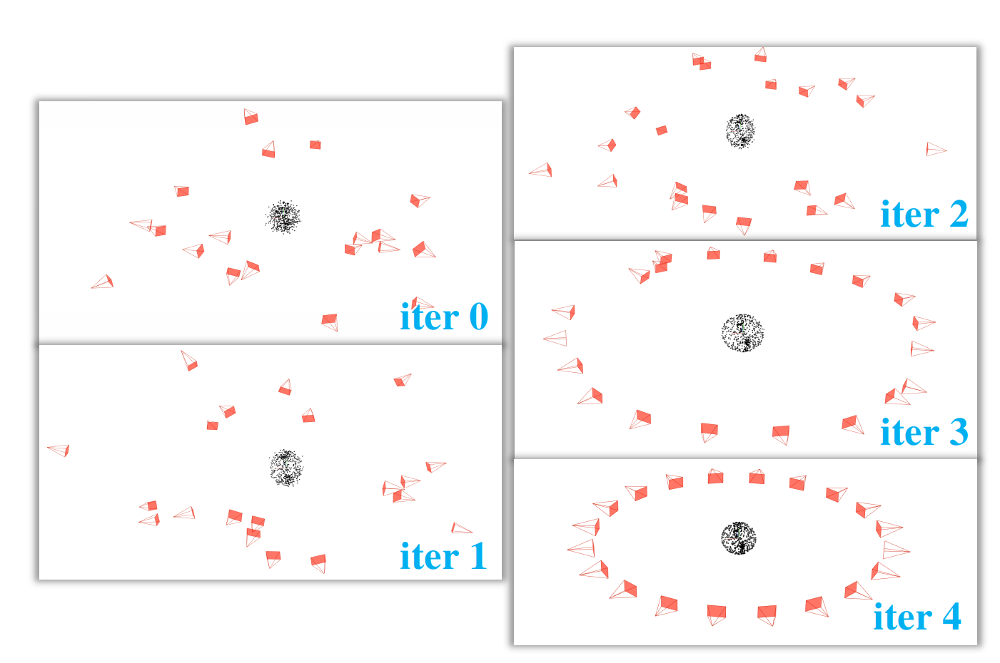

# matlab_BA

This is a application of BA by matlab. Borrowing from [Colmap](https://colmap.github.io/)'s model format. Because of this, you can easily use [colmap](https://github.com/colmap/colmap) to read the model and perform experiments.

Simple use of the Gauss-Newton method for iterative optimization in the script.


#### Demo

Use [demo.m](/demo.m) to reproduce results. Result will be saved in [/model](/model).

The demo provides a BA simulation method. We created 20 cameras and 500 map points for simulation. The ground truth of the simulation is shown in the figure below.


The model in the iteration can be visualized through colmap, as shown in the figure below



#### Cost result

```
iter 1 : error = 8.75141e+08 , error_mean = 209.181802 Elapsed time is 3.160879 seconds.
iter 2 : error = 1.00484e+08 , error_mean = 70.881563 Elapsed time is 3.150218 seconds.
iter 3 : error = 5.27377e+06 , error_mean = 16.238487 Elapsed time is 3.154442 seconds.
iter 4 : error = 128678 , error_mean = 2.536510 Elapsed time is 3.081365 seconds.
iter 5 : error = 18561.6 , error_mean = 0.963370 Elapsed time is 3.080872 seconds.
iter 6 : error = 19287.2 , error_mean = 0.982019 Elapsed time is 3.044613 seconds.
```


#### Time test

In my simple test, I found that the optimization speed using [ceres](https://github.com/ceres-solver/ceres-solver) is about 150 times faster than matlab.